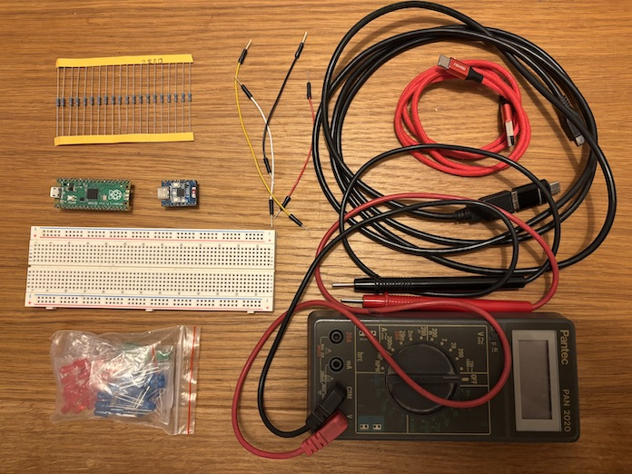

.. Copyright 2025 Paul Guyot <pguyot@kallisys.net>
..
.. SPDX-License-Identifier: CC-BY-SA-4.0

Blinking a LED (Pico or ESP32)
==============================

This tutorial shows you how to blink an LED using AtomVM and GPIO control.

Hardware Requirements
---------------------

- A Raspberry Pi Pico or a an ESP32 microcontroller board with GPIO pins
- A USB cable to connect the board to a laptop (macOS or Linux)
- A LED preferrably red
- A resistor (150 Ω or higher)
- Few dupont wires
- A breadboard

You may also want to use a multimeter.

If your multimeter has a diode testing feature (usually with the diode symbol in the Ohm-meter zone), you may want to check the LED still works by connecting the longer leg (anode) to the V/Ω input of the multimeter and the shorter leg (cathode) of the LED to the GND input.

You may also want to check the resistance of the resistor you will use. If you have the specification of the LED you want to use, you can apply Ohm law to compute the proper resistor value. Usual boards often have a 5V pin but will supply a 3.3V level with GPIOs, so for a 10 mA 1.8V red LED, 150 Ω would work.

Software Requirements
---------------------

This tutorial supposes you already installed AtomVM on your board and you have installed the appropriate build tools (rebar3, mix or gleam) for your favorite language on your desktop machine. For gleam, you will need to install packbeam and uf2tool (for Pico) or esptool.py (for ESP32).

You will also need ``minicom`` or an alternate serial console software.

Circuit
-------

Connect the LED to a GPIO pin (or any available GPIO pin) through a resistor to ground.

.. figure:: build/assets/led_circuit.svg
   :alt: LED blinking circuit diagram
   :align: center
   :width: 400px

   Circuit diagram showing GPIO connected through a 150Ω resistor to the anode of a LED, with the LED cathode connected to ground.

.. figure:: build/assets/led_breadboard.svg
   :alt: LED blinking breadboard circuit diagram. CC BY-SA 4.0. Pico image by Efa.
   :align: center
   :width: 600px

   Breadboard circuit diagram showing the physical connections for blinking an LED with a Raspberry Pi Pico.

Creating and configuring the project
------------------------------------

Use build tools to generate an empty project.

.. tab:: Erlang

  Create a new directory and initialize a rebar3 project:

  .. code-block:: bash

     rebar3 new lib blink_led
     cd blink_led

  Your project structure should look like:

  .. code-block:: text

     blink_led/
     ├── rebar.config
     ├── src/
     │   ├── blink_led.app.src
     │   └── blink_led.erl

  Add the following line to ``rebar.config``:

  .. code-block:: erlang

     {plugins, [atomvm_rebar3_plugin]}.

.. tab:: Elixir

  Create a new directory and initialize a mix project:

  .. code-block:: bash

     mix new blink_led

  Your project structure should look like:

  .. code-block:: text

     blink_led/
     ├── mix.exs
     ├── lib/
     │   └── blink_led.ex
     ├── test/
     │   ├── blink_led_test.exs
     │   └── test_helper.exs

  Update the ``mix.exs`` file with the atomvm elements definition of the
  project as well as the dependency on the exatomvm plugin.

  .. code-block:: elixir

    defmodule BlinkLed.MixProject do
      use Mix.Project

      def project do
        [
          app: :blink_led,
          version: "0.1.0",
          elixir: "~> 1.18",
          start_permanent: Mix.env() == :prod,
          deps: deps(),
          # Add these lines:
          atomvm: [
            start: BlinkLed
          ]
        ]
      end

      # Run "mix help compile.app" to learn about applications.
      def application do
        [
          extra_applications: [:logger]
        ]
      end

      # Run "mix help deps" to learn about dependencies.
      defp deps do
        [
          # Also add these lines (optional pythonx will deliver a better esp32 experience)
          {:exatomvm, git: "https://github.com/atomvm/ExAtomVM/", runtime: false},
          {:pythonx, "~> 0.4.0", runtime: false, optional: true}
        ]
      end
    end

.. tab:: Gleam

  Create a new directory and initialize a Gleam project:

  .. code-block:: bash

     gleam new blink_led

  Your project structure should look like:

  .. code-block:: text

     blink_led/
     ├── gleam.toml
     ├── src/
     │   └── blink_led.gleam
     ├── test/
     │   └── blink_led_test.gleam

    We are going to need gleam_erlang for our sample.

  .. code-block:: bash

     cd blink_led
     gleam add gleam_erlang

Add the blink code
------------------

In this tutorial, we are going to write a single module.

.. tab:: Erlang

  Create the main module in ``src/blink_led.erl``:

  .. code-block:: erlang

    -module(blink_led).
    -export([start/0]).

    -define(PIN, 0).

    start() ->
        ok = gpio:init(?PIN),
        ok = gpio:set_pin_mode(?PIN, output),
        blink_loop(1).

    blink_loop(Value) ->
        gpio:digital_write(?PIN, Value),
        timer:sleep(1000),
        blink_loop(1 - Value).

.. tab:: Elixir

  Create the main module in ``lib/blink_led.ex``:

  .. code-block:: elixir

    defmodule BlinkLed do
      # Define pin based on platform
      @pin 0

      def start do
        :ok = GPIO.init(@pin)
        :ok = GPIO.set_pin_mode(@pin, :output)
        blink_loop(1)
      end

      defp blink_loop(value) do
        GPIO.digital_write(@pin, value)
        :timer.sleep(1000)
        blink_loop(1 - value)
      end
    end

.. tab:: Gleam

  There is no official binding for gleam and we will need to declare our gpio
  functions. Also, we'll suppose for now they never return an error.

  Create the main module in ``src/blink_led.gleam``:

  .. code-block:: gleam

    import gleam/erlang/process

    const pin = 0

    pub type Direction {
      Input
      Output
      OutputOd
    }

    @external(erlang, "gpio", "init")
    pub fn gpio_init(pin: Int) -> Nil

    @external(erlang, "gpio", "set_pin_mode")
    pub fn gpio_set_pin_mode(pin: Int, direction: Direction) -> Nil

    @external(erlang, "gpio", "digital_write")
    pub fn gpio_digital_write(pin: Int, level: Int) -> Nil

    pub fn start() {
        gpio_init(pin)
        gpio_set_pin_mode(pin, Output)
        blink_loop(1)
    }

    fn blink_loop(level) {
        gpio_digital_write(pin, level)
        process.sleep(1000)
        blink_loop(1 - level)
    }

Building, flashing and running on Raspberry Pi Pico
---------------------------------------------------

To program the Raspberry Pi Pico, you need to press the button and connect it,
and then write an .uf2 file on the mounted drive.

.. tab:: Erlang

    .. code-block:: bash

        cd blink_led
        rebar3 atomvm pico_flash

    rebar3, with AtomVM plugin, automatically builds, packs (to .avm), creates the uf2, puts the Pico in the proper mode and copies the firmware at the proper location. It doesn't hurt to do the steps one after the other if you prefer.

    .. code-block:: bash

        rm -rf _build
        rebar3 get-deps
        rebar3 compile
        rebar3 atomvm packbeam
        rebar3 atomvm uf2create
        rebar3 atomvm pico_flash

    If there are some errors such as ``"===> Pico not mounted at /Volumes/RPI-RP2."`` on macOS, unplug the Pico, press the button, plug it (maybe on another USB port) and check that indeed ``/Volumes/RPI-RP2`` exists. The equivalent path on Linux is ``/run/media/${USER}/RPI-RP2``.

    Also, macOS will display an alert `Disk Not Ejected Properly`. This is a known issue between Raspberry Pi and Apple. You can just ignore it.

.. tab:: Elixir

    With mix, you need first to install dependencies:

    .. code-block:: bash

        cd blink_led
        mix deps.get

    Then you can build and flash with:

    .. code-block:: bash

        mix atomvm.pico.flash

    You can safely ignore the warnings about GPIO module being not available for this tutorial, as well as the warning about ``avm_deps`` directory being not found, as the tutorial code doesn't use any Erlang or Elixir module. But if you were to use Elixir modules, you would need to create an avm_deps directory for your .avm file to embed Elixir modules not present in the lib partition.

    mix, with ExAtomVM plugin, automatically builds, packs (to .avm), creates the uf2, puts the Pico in the proper mode and copies the firmware at the proper location. It doesn't hurt to do the steps one after the other if you prefer.

    .. code-block:: bash

        rm -rf _build
        mix compile
        mix atomvm.packbeam
        mix atomvm.uf2create
        mix atomvm.pico.flash

.. tab:: Gleam

    The first step is to compile everything as an erlang-shipment so we know all .beam files are generated.

    .. code-block:: bash

        cd blink_led
        gleam export erlang-shipment

    We can now pack all beams with packbeam

    .. code-block:: bash

        packbeam create blink_led.avm build/erlang-shipment/*/ebin/*.beam

    Next step is to convert this avm file to uf2.

    .. code-block:: bash

        uf2tool create -o blink_led.uf2 -s 0x10180000 blink_led.avm

    Eventually, you can plug the Pico with button pressed and copy the UF2 on it.

    .. tab:: Linux

        .. code-block:: bash

            cp blink_led.uf2 /run/media/${USER}/RPI-RP2

    .. tab:: macOS

        .. code-block:: bash

            cp blink_led.uf2 /Volumes/RPI-RP2

Once the Pico is programmed, it will not restart immediately. AtomVM's default
setting is to wait for the Pico to be plugged on the serial console before
booting which is very convenient when developing because you can see anything
that happens during boot. There is a timeout and it will boot eventually.

To connect to it:

.. tab:: Linux

    .. code-block:: bash

        minicom -D /dev/ttyACM0

.. tab:: macOS

    .. code-block:: bash

        minicom -D /dev/cu.usbmodem14*

To exit minicom, press ``control-A`` and then ``X`` and then enter for ``Yes``. It can be frustrating and
unplugging may help.

Exercises
---------

You can alter the tutorial code, for example:
- Changing the blink rate
- Add multiple LEDs for different patterns
- Use a button connected to another GPIO to control the blinking
